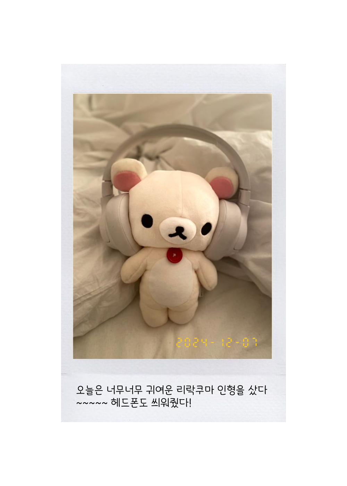

# 폴라로이드

<b>폴라로이드 사진으로 특별한 날을 기념하자🐥 
</b>특별한 날에, 폴라로이드 사진을 만들어서 기록으로 남겨보아요 

👉 배포 주소: https://polaroid-snap-diary.vercel.app/
🔔 개발 중인 상태라서 현재는 제대로 동작하지 않는 상태입니다.

 

### 관련 블로깅

1. <a href='https://velog.io/@hamham/%EC%BB%B4%ED%8F%AC%EB%84%8C%ED%8A%B8%EB%A5%BC-%EC%9D%B4%EB%AF%B8%EC%A7%80%EB%A1%9C-%EB%B3%80%ED%99%98%ED%95%98%EA%B8%B0satoriresvg-vercelog'>컴포넌트를 이미지로 변환하기(Satori+resvg-js, @vercel/og)</a>
2. <a href='https://velog.io/@hamham/%EC%9D%B4%EB%AF%B8%EC%A7%80-%EC%97%85%EB%A1%9C%EB%93%9C-%EA%B8%B0%EB%8A%A5-%EB%A7%8C%EB%93%A4%EA%B8%B0Supabase-Storage-%EB%AF%B8%EB%A6%AC%EB%B3%B4%EA%B8%B0'>이미지 업로드 기능 만들기(Supabase Storage, 이미지 미리보기)</a>
    
